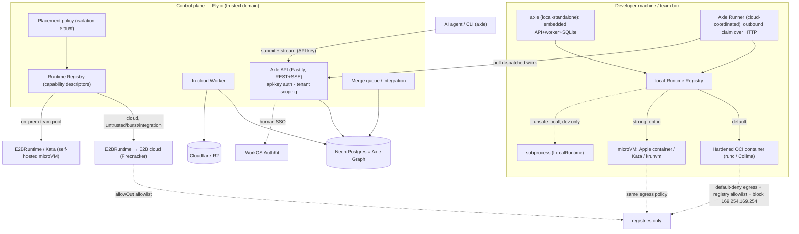

# Axle Execution Infrastructure

The infrastructure spine for Axle: the cloud control plane, the holistic
**local + cloud** execution model, the technology decisions, and the rollout.
Everything lands **behind interfaces that already exist** (`Runtime` /
`ExecutionEnvironment`, `ExecutionStore`, `ArtifactStore`, `ExecutionPolicy`), so
the product layer is never rewritten.

**See also:** [`local-runtime.md`](local-runtime.md) (why local matters + how the
local runtime is built) · [`parallel-execution.md`](parallel-execution.md)
(many agents, conflicting changes, worktrees) · [`architecture.md`](architecture.md)
· [`execution-model.md`](execution-model.md) · [`roadmap.md`](roadmap.md).

---

## 1. Context & scope

The bootstrap proves the Execution primitive on a single node: `LocalRuntime`
(no isolation), a SQLite file, a local-filesystem artifact store, one worker
polling a DB-backed queue. Turning this into infrastructure must serve **both** a
hosted cloud service **and** first-class **local/self-hosted execution** — many
small teams will prefer local for privacy, cost, offline, and because Axle's
founding promise ("don't contaminate the developer's machine") applies to the
local box too.

**Constraints that anchor these decisions:** phased (beta → platform, beta a
strict subset); rent the microVM isolation layer first; no cloud priors; **local
is first-class, designed in from the start.**

---

## 2. Core reframe — one seam, placement not products

The `Runtime` interface is the **placement boundary**. Local and cloud are not two
products; they are **peers in a registry of providers**, chosen per-execution by a
policy. Everything is **OCI**, so the *same* `node-22` image runs at every rung
(laptop container → laptop microVM → on-prem runner → cloud microVM). Untrusted
execution always stays on a **separate network/trust domain from the control
plane**.

Two invariants:

- **`isolation ≥ trust`.** Placement may never run a payload below its required
  isolation. Untrusted code (agent-authored branches; third-party deps whose
  install scripts run) requires **≥ microVM**; it may never fall back to a raw
  subprocess.
- **Execution never mutates the origin.** Every run is a fresh, ephemeral
  workspace materialized from a snapshot; the developer's real files are never
  touched.

The substrate is dominated by three constraints that fight each other — **hard
isolation × cold-start latency (the agent inner loop, not CI) × idle cost
(bursty)**. Only **microVMs (Firecracker / Kata / Apple `container`)** satisfy all
three. See [`local-runtime.md`](local-runtime.md) for the local isolation ladder.

---

## 3. Decisions (landed)

| Decision | Choice | Runner-up → why it lost |
| --- | --- | --- |
| **Default posture** | **Local-first, secure-by-default, cloud-burst.** Fresh `axle` runs locally in a hardened OCI container, no cloud account; cloud is opt-in for scale/parallelism/unavailable-profiles. | Cloud-first: simpler ops but loses privacy/cost/offline teams and buries the "protect the machine" promise. |
| **Secure local isolation** | **OCI ladder, same image every rung:** hardened container (Docker/Podman/Colima) → microVM (**Apple `container`** on mac, **Kata/krunvm** on Linux). Raw subprocess demoted to `--unsafe-local`. | A single fixed tier: too weak for untrusted code or too heavy for quick trusted checks. |
| **Cloud execution substrate** | **E2B** — rent now; self-host `e2b-dev/infra` at volume, *same adapter*; also powers an on-prem strong-runner pool. | Daytona (closed-source, enterprise-only, container-default); Modal (gVisor/GPU, Python-centric); Fly Machines (a primitive — you'd build the sandbox). |
| **Local ↔ cloud placement** | **Layered policy** (override → hard gates → deterministic heuristic → Graph-informed), gated by `isolation ≥ trust`. | LLM/dynamic routing from day one: unpredictable for a dev tool. |
| **Runtime selection seam** | Generalize `selectRuntime()` → **Runtime Registry** of capability descriptors `{isolation, cpu/mem, profiles, cost, egressControl, location, online}`. | Docker-else-Local fallback can't express placement across laptop/on-prem/cloud. |
| **Control-plane host** | **Fly.io** — SSE first-class, per-second, worker-friendly. | Railway (near-tie DX); Cloud Run (worker needs min-instances=1). |
| **Postgres (the Graph)** | **Neon** — serverless, scale-to-zero, branch-per-PR, compute-independent. | Crunchy/RDS: no scale-to-zero; revisit on an AWS enterprise re-platform. |
| **Object store** | **Cloudflare R2** — S3-compatible, zero egress fees, host-independent. | Tigris (Fly-native alt, also no egress). |
| **Queue** | **Postgres** (`FOR UPDATE SKIP LOCKED`); a runner claims the same queue over an **authenticated HTTP endpoint**. | Redis/SQS premature; the `claimNextQueued` seam makes it free later. |
| **Auth** | **Build** agent API keys + tenant scoping (mandatory) · **Buy** WorkOS AuthKit for human SSO (fast-follow, free to 1M MAU). | Clerk: better React DX but pricier past 10k MAU, less enterprise-SSO-focused. |

**Why E2B is the keystone:** Firecracker microVMs (~150ms, per-second ~$0.05/vCPU-hr)
purpose-built for agent code; the exact egress control Axle needs (`allowOut`
domain allowlist + `updateNetwork`); **open-source infra (Apache-2.0, Terraform +
Nomad + Firecracker).** The *same* `E2BRuntime` adapter serves rent, self-host at
volume, and an on-prem pool — cloud/self-host/on-prem are one adapter. **Beta cost
is trivial:** a ~60s verify ≈ $0.0006 of E2B compute; local runs are free;
Neon/Fly/R2/WorkOS ≈ free at beta volume.

---

## 4. Target architecture

The developer-machine half (local runtimes, the scheduler, the capability
envelope) is detailed in [`local-runtime.md`](local-runtime.md); the merge
queue / integration path is detailed in
[`parallel-execution.md`](parallel-execution.md).

---

## 5. Rollout & seam changes

**Phases** (local ships first):

| Phase | Theme | Key work |
| --- | --- | --- |
| **L** | Secure local, first-class | Harden `DockerRuntime` (OCI, non-root, ro-rootfs, seccomp, egress allowlist, resource caps, ephemeral); demote `LocalRuntime` → `--unsafe-local`; **Runtime Registry** + capability descriptors; **placement policy v0** (override → gates → heuristic); execution `trustLevel` in contracts; local-standalone mode. Strong tier (Apple `container`/Kata) as an opt-in sub-step. |
| **A** | Cloud control plane | `PostgresExecutionStore` (`FOR UPDATE SKIP LOCKED`; `BIGSERIAL` seq); `S3ArtifactStore` (R2); config selection; **API-key auth + tenant scoping**; `fly.toml` deploy; OTel (queue-wait, cold-start, isolation-failures). |
| **B** | E2B cloud runtime | `E2BRuntime` (`packages/runtime-e2b`); `allowOut` egress + registry cache; warm dep cache; per-execution secret injection. |
| **H** | Cloud-coordinated Runner | authenticated HTTP "claim" endpoint generalizing `claimNextQueued`; runner daemon (outbound-only) for local/on-prem execution + cloud Graph. |
| **C** | Own the cloud substrate | self-host `e2b-dev/infra` (same adapter, re-pointed); on-prem strong-runner pool; exotic profiles (macOS/GPU/dind). |
| **Parallel exec** | Conflict handling | (1) Graph overlap map (file) + `merge-tree` prediction → (2) `axle workspace` fleet mgmt → (3) integration verification (dep-pruned) → (4) merge queue + speculative exec → (5) semantic overlap via dep graph. See [`parallel-execution.md`](parallel-execution.md). |
| **Later** | Graph-informed placement | learn duration/resource/flakiness per change-shape + local contention; feed placement + plan shrinking (test impact). |

**Seam changes (small, additive):**
- `contracts`: add execution **`trustLevel`** (`trusted-local | untrusted`) + a
  capability-envelope shape on `ExecutionPolicy`.
- `runtime`: `isAvailable()` → **capability descriptor**; add a **Runtime
  Registry** + a placement policy (replaces `selectRuntime()` fallback).
- `persistence`: `PostgresExecutionStore` behind `ExecutionStore`; an
  authenticated **HTTP claim** transport over the same queue.
- `artifacts`: `S3ArtifactStore` behind `ArtifactStore`.
- new: `packages/runtime-e2b`, `packages/persistence-postgres`, `axle workspace`,
  overlap/integration/merge-queue services (graph-side).

This sequence extends [`roadmap.md`](roadmap.md); Phase A/B correspond to the
roadmap's "real DockerRuntime" and "additional runtimes" arcs, made concrete.

---

## 6. Deliberately deferred (clean seam later; premature now)

Redis/SQS, Kubernetes, multi-region, `LISTEN/NOTIFY`, a from-scratch Firecracker
fleet (superseded by self-hosted E2B), LLM-driven placement, auto-merge of
conflicting changes, and **Daytona** (revisit only for an enterprise buyer wanting
its compliance-first / BYO-compute model). An **AWS** re-platform
(Fargate/Aurora/S3) is the expected enterprise-scale move — cheap precisely because
everything is behind the existing interfaces.

---

## 7. Verification / validation

**Phase L (local)** — `axle verify` runs in a hardened container on mac + Linux;
workspace untouched; CPU/RAM caps hold (editor not starved); `isolation ≥ trust`
refuses raw subprocess for untrusted and runs the *same image* under microVM;
placement: override wins, offline forces local, cloud-only profiles route to cloud.

**Phase A/B (cloud)** — hosted `run`/`verify` end-to-end; **kill a worker
mid-execution** → another claims cleanly (SKIP LOCKED), no double-run; artifacts in
R2; **2-min SSE stream survives the Fly LB**; replay-from-seq-0; tenant isolation.
Security gate: fork-bomb/CPU-burn (caps hold), egress-exfil (blocked by `allowOut`),
metadata SSRF to `169.254.169.254` (blocked), fs-escape; cold-start p50/p95;
warm-cache install speedup; `destroy()` always runs.

**Phase H (runner)** — a runner behind NAT (outbound-only) claims + completes
cloud-dispatched work; revoking its key stops dispatch; execution data stays on the
runner's box while history lands in the cloud Graph.

**Parallel execution** — validation lives in
[`parallel-execution.md`](parallel-execution.md).
